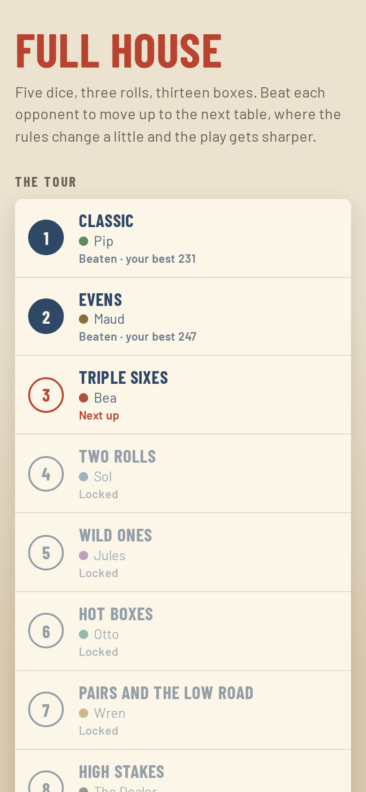
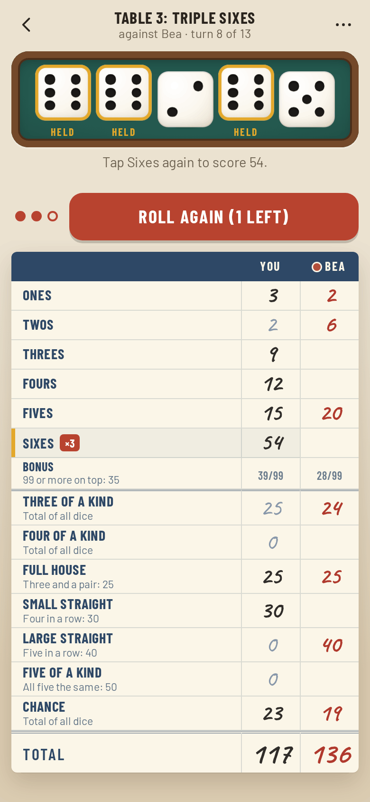
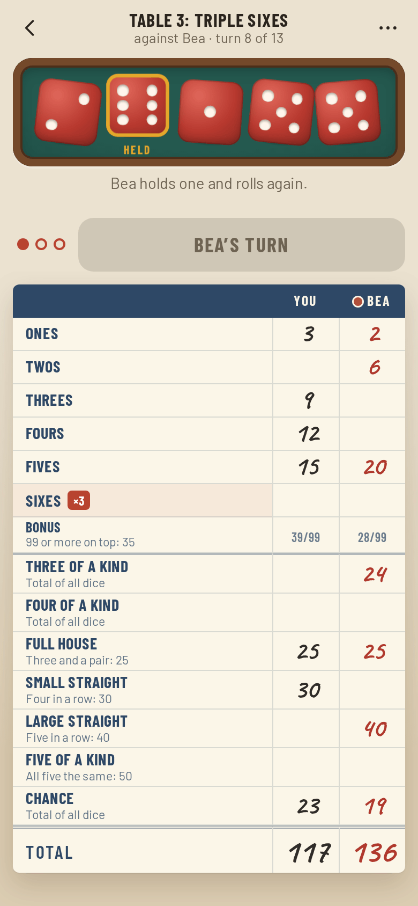
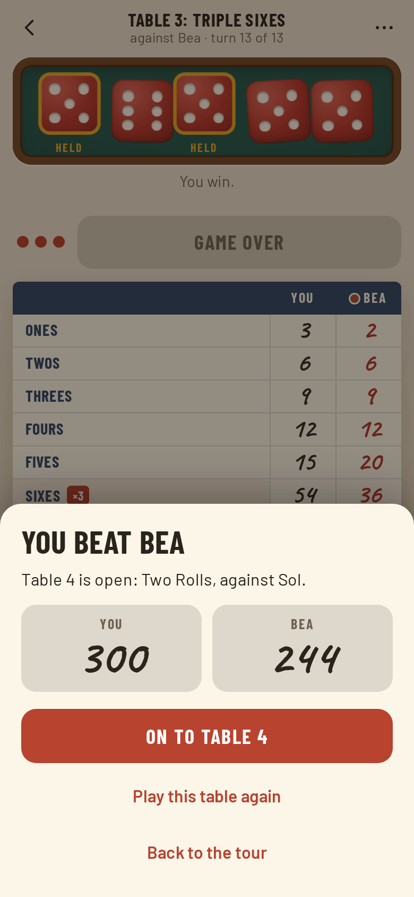

# Full House

**Play it: [full-house.junkdrawer.works](https://full-house.junkdrawer.works/)**

**A five-dice game against a ladder of eight opponents, each sharper than the last, on tables that change the rules.** Roll in the felt tray, hold what you like, and pencil your score into the pad beside your opponent's. Beat an opponent to move up a table: Evens in place of Ones, Sixes that score three times over, two-roll turns, wild ones, and on up to the Dealer.

<p align="center">
  
  &nbsp;
  
</p>
<p align="center">
  
  &nbsp;
  
</p>

## How it plays

- **Five dice, three rolls, thirteen boxes.** Hold any dice between rolls, then fill one box a turn: the six number boxes on top (63 or more earns a 35-point bonus), then three and four of a kind, a full house, small and large straights, five of a kind and chance. Every five of a kind after the first is worth 100 more, with the usual rules for where it can go.
- **Pick, then score.** Tap a box to pick it and tap it again to write it in, so a slip of the thumb doesn't cost you a box. After each roll the open boxes show what the dice would score there, unless you turn that off.
- **The tour.** Eight tables, in order, each with its own twist and its own opponent:
  1. **Classic** against Pip, who keeps whatever there's most of.
  2. **Evens** against Maud: the Ones box is gone, and Evens adds up every even die instead.
  3. **Triple Sixes** against Bea: the Sixes box scores three times over.
  4. **Two Rolls** against Sol: two rolls a turn instead of three.
  5. **Wild Ones** against Jules: in the bottom section, a 1 counts as whatever number scores best.
  6. **Hot Boxes** against Otto: two boxes, picked at random each time you sit down, score three times over.
  7. **Pairs and the Low Road** against Wren: Two pairs replaces three of a kind, and the Low road (30 for a total of 12 or less) replaces chance.
  8. **High Stakes** against the Dealer: four rolls a turn, and the bottom section scores double.
- **Opponents who plan.** Five dice can only land 252 different ways, so an opponent works out, for every possible roll, which dice to keep for the best result over the rest of its turn. It values each box by what it scores now, what it might be worth later, and the top-section bonus. The early opponents leave parts of that out and make mistakes on purpose, and some have a style: Jules chases five of a kind, Otto rarely misses the bonus. On classic rules Pip averages about 136, and the Dealer about 240 (the best possible play averages about 254).
- **Watch them play.** Their red dice tumble in your tray and their scores go into the pad in red pencil. Tap the dice to hurry them along, or turn on quick opponents.
- **Quick game.** Classic rules against anyone you've met on the tour.
- **Your progress.** The tables you've beaten and your best score at each. Giving up part way counts as a loss.
- **On a keyboard,** Space or R rolls, and 1 to 5 hold the dice.
- No ads, no account and no server. Your progress and any game in progress stay in your browser. It works offline and installs to a phone's home screen.

## Running it

It's a static site: plain HTML, CSS and JavaScript, with no build step.

```sh
npx serve .                    # or any static file server, then open the printed address
npm install                    # once, for the bundler and the screenshot tool's PNG compressor
npm test                       # the rules and the opponents in Node, then a game played in Chromium (needs Playwright)
node tools/screenshots.mjs     # redraws docs/*.png and og.png
node tools/make-icons.mjs      # redraws the PNG icons from icon.svg
npm run build                  # bundles everything into dist/full-house.html, one file you can send around
node dev/strength.mjs 300 all  # how each opponent scores at its own table, against the best settings
```

To put it online with GitHub Pages: **Settings → Pages → Build and deployment → Deploy from a branch**, then pick `main` and `/ (root)`.

### Files

- `js/rules.js`: the rules. Boxes as plain data, scoring (wild ones and multipliers included), the five-of-a-kind bonus and joker rules, and the totals.
- `js/tour.js`: the eight tables, each a board and an opponent.
- `js/ai.js`: how the opponents play. Every roll and every handful of dice you might keep, worked out ahead, and the values that make one opponent better than another.
- `js/dice.js`: the dice, drawn as real cubes that tumble and land face up.
- `js/pad.js`: the score pad.
- `js/app.js`: the tour, your turns, the opponent's turns played out on the table, and saving.
- `fonts/`: Barlow, Barlow Condensed and Caveat (SIL Open Font License), served from here so nothing loads from elsewhere.
- `sw.js`: keeps a copy for playing offline.
- `test/`: the rules and the opponents in Node, and a game played through the real page.
- `dev/`: tools used while building it: opponent strength runs and quick screenshots.
